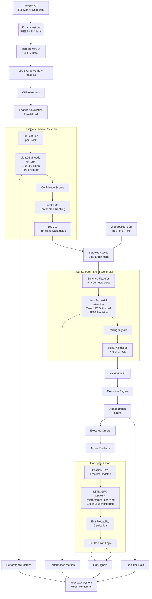

# GH200 Trading System Architecture

This document provides a comprehensive overview of the GH200 Trading System architecture, detailing the data flow, processing steps, and key components.

## System Overview

The GH200 Trading System is a high-performance trading system designed for the NVIDIA GH200 platform. It uses a hybrid HFT (High-Frequency Trading) architecture, combining machine learning models with traditional trading strategies. The system ingests market data, generates trading signals, manages risk, and executes trades with extremely low latency.

## System Architecture

## Key Components

### 1. Data Ingestion
- **Polygon.io API Integration**: 
  - REST API for full market snapshot of all tickers
  - WebSocket for real-time trade and quote updates
- **Data Processing**:
  - JSON parsing and normalization
  - Direct GPU memory mapping for efficient processing

### 2. Feature Extraction
- **CUDA-Accelerated Processing**:
  - Parallelized calculation of 20+ technical indicators per stock
  - Market microstructure features
  - Real-time feature normalization

### 3. Two-Phase ML Inference
- **Fast Path (Market Scanner)**:
  - LightGBM model (100-200 trees) optimized with TensorRT.
  - The LightGBM model architecture consists of [ADD ARCHITECTURE DETAILS HERE].
  - FP8 precision for maximum throughput.
  - Processes entire market (10,000+ stocks) in milliseconds.
  - Identifies 100-300 promising candidates.
  - Uses the following features: [ADD FEATURE LIST HERE]

- **Accurate Path (Signal Generator)**:
  - Modified Axial Attention model optimized with TensorRT.
  - The Axial Attention model architecture consists of [ADD ARCHITECTURE DETAILS HERE].
  - FP16 precision for balance of accuracy and speed.
  - Detailed analysis of candidates with enriched features.
  - Generates concrete trading signals.

### 4. Risk Management
- **Pre-Trade Validation**:
  - Position sizing using Kelly criterion
  - Correlation checks for portfolio diversification
  - Risk exposure limitations
  - Drawdown management

### 5. Execution Engine and Order Management
- **Execution Engine**:
  - Processes validated signals from risk management
  - Creates order objects with appropriate parameters
  - Handles both simple and bracket orders

- **Alpaca Broker Client**:
  - Communicates with the Alpaca API to submit, modify, and cancel orders.
  - Uses bracket orders to set trades with entry, take-profit, and stop-loss levels in a single order submission.
  - Currently configured for paper trading, but can be configured for live trading by providing Alpaca API keys.

### 6. Exit Optimization
- **LSTM/GRU Network**:
  - Reinforcement learning approach.
  - The LSTM/GRU network architecture consists of:
    - Stacked LSTM/GRU network with 3 layers
    - 128 hidden units per layer
    - Bidirectional architecture
    - Attention mechanism for focusing on relevant price movements
    - Reinforcement learning approach (Double DQN)
  - Takes the following inputs:
    - Current position data: entry price, time in position, unrealized P&L
    - Market context: volatility, trading volume, trend strength
    - Technical indicators at multiple timeframes
    - Order book dynamics and flow
  - Outputs:
    - Exit probability distribution
    - Optimal exit price targets
    - Trailing stop adjustments
  - Continuous monitoring of open positions.
  - Dynamic adjustment of exit parameters.
  - Probability distribution for optimal exit timing.

### 7. Feedback System
- **Performance Metrics**:
  - End-to-end latency monitoring.
  - The following performance metrics are tracked:
    - **Latency Metrics**:
      - End-to-end latency (target: <1ms for fast path, <10ms for full pipeline)
      - Component-level latencies: data ingestion, feature extraction, inference, risk check, order submission
      - Jitter and worst-case latency
    - **Trading Performance**:
      - Win rate and profit factor
      - Sharpe and Sortino ratios
      - Maximum drawdown and recovery time
      - P&L per symbol and strategy
    - **System Metrics**:
      - CPU, GPU, and memory utilization
      - Network throughput and packet loss
      - Model throughput (inferences/second)
      - Error rates and system stability
  - Signal accuracy tracking.
  - P&L attribution.
  - Model drift detection.

## Performance Characteristics

- Sub-millisecond latency for the fast path (market scanning)
- Single-digit millisecond latency for the end-to-end pipeline
- Support for 10,000+ symbols in real-time
- Efficient GPU utilization with NVIDIA GH200

## Hardware Optimization

- **CPU Optimization**:
  - Thread pinning to specific CPU cores for critical components
  - NUMA-aware memory allocation
  - Process/thread priority management
  - Cache-conscious data structures and algorithms
- **GPU Optimization**:
  - Zero-copy GPU-CPU transfers
  - Kernel fusion for feature calculation
  - Persistent CUDA kernels
  - GPU memory pooling
  - Asynchronous execution streams
- **Memory Optimization**:
  - Use of huge pages for large memory allocations
  - Memory pre-allocation and pooling
  - Cache-conscious data structures
  - Custom memory allocators
- **Network Optimization**:
  - Kernel bypass networking (DPDK)
  - TCP_NODELAY for minimum latency
  - Optimized socket buffer sizes
  - Direct market data path to GPU memory

## Monitoring & Alerting

- Real-time performance dashboards
- Latency alerts
- Model drift detection
- Risk exposure notifications