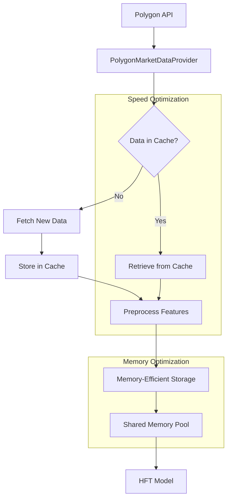
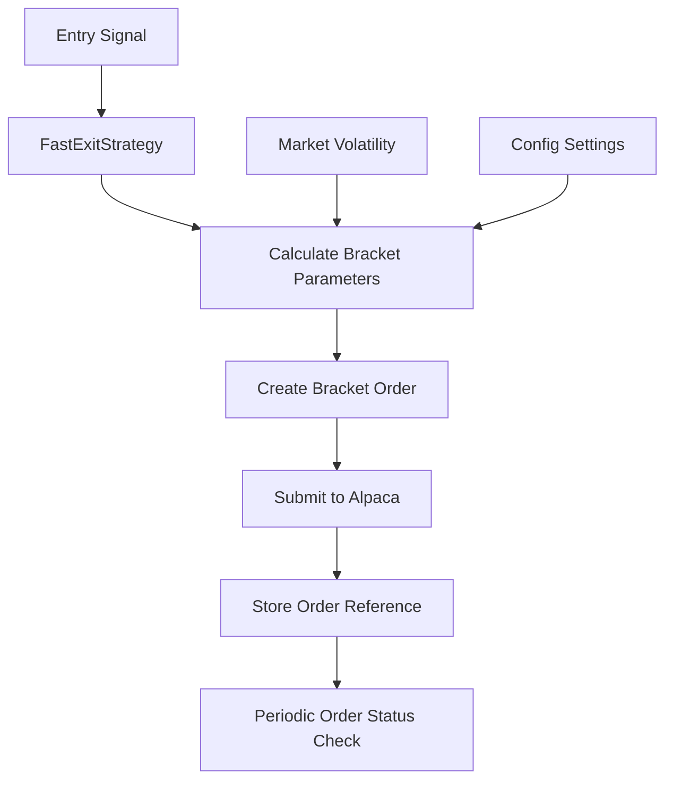
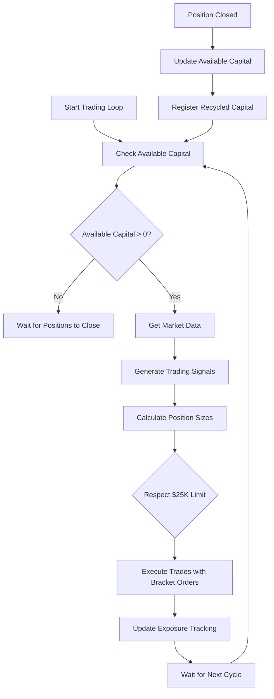

# Trading System Optimization Plan

## Overview

This plan addresses three key improvements to our GH200 Trading System:

1. **Data Preparation Optimization**: Enhancing how data is prepared in the Polygon Market Data Provider for the HFT model, with emphasis on memory efficiency while maintaining speed.

2. **Bracket Exit Implementation**: Implementing a bracket exit strategy using Alpaca's native bracket order capabilities with volatility-adjusted parameters and configurable settings.

3. **Timed Trading Loop with Capital Recycling**: Implementing a timed loop that respects a $25,000 daily maximum exposure limit while recycling capital from closed positions.

## 1. Data Preparation Enhancements for Polygon Market Data Provider

### Current Data Pipeline Limitations

Currently, the Polygon Market Data Provider has several inefficiencies:

- Creates new feature arrays instead of using pre-allocated memory
- Does not fully utilize the SharedGPUMemoryPool implementation that exists
- Performs redundant data transformations between components
- Feature normalization happens in the model rather than in the provider

### Improved Data Pipeline Architecture



### Implementation Details

#### 1. Memory-Efficient Feature Processing

Enhance the `PolygonMarketDataProvider` class to optimize memory usage:

```python
def prepare_model_features(self, symbols: List[str], reuse_buffers: bool = True) -> Dict[str, Any]:
    """
    Prepare features for model inference with memory efficiency as priority.
    
    Args:
        symbols: List of symbols to process
        reuse_buffers: Whether to reuse existing memory buffers
        
    Returns:
        Dictionary with memory-optimized feature arrays
    """
    # Implementation details:
    # 1. Check for existing buffers in shared memory pool
    # 2. Reuse buffers when possible to avoid allocations
    # 3. Perform in-place normalization
    # 4. Set memory layout to match model's expected format
```

Add direct normalization to match the model's parameters:

```python
def normalize_features(self, features: np.ndarray, stats: Dict[str, np.ndarray], 
                       in_place: bool = True) -> np.ndarray:
    """
    Normalize features using the model's statistics.
    
    Args:
        features: Raw feature array
        stats: Dictionary with normalization parameters
        in_place: Whether to perform normalization in-place
        
    Returns:
        Normalized features
    """
    # Implementation details:
    # 1. Extract mean and std from stats
    # 2. If in_place=True, normalize directly in the provided array
    # 3. Apply optimized vectorized operations
    # 4. Handle edge cases like division by zero
```

#### 2. Enhanced Memory Pool Integration

Improve the `SharedGPUMemoryPool` integration:

```python
def get_or_allocate_buffer(self, symbol: str, shape: Tuple[int, ...], 
                          dtype: np.dtype) -> Union[np.ndarray, cp.ndarray]:
    """
    Get an existing buffer or allocate a new one in the shared pool.
    
    Args:
        symbol: Symbol identifier
        shape: Required buffer shape
        dtype: Data type
        
    Returns:
        Memory buffer from the pool
    """
    # Implementation details:
    # 1. Check if buffer exists for symbol with matching shape/type
    # 2. If exists, return existing buffer
    # 3. If not, allocate new buffer in shared pool
    # 4. Register buffer with symbol for future reuse
```

#### 3. Direct Model Input Integration

Create a direct data pipeline to the model:

```python
def get_model_ready_data(self, symbols: List[str]) -> Dict[str, Any]:
    """
    Get data in a format directly consumable by the model with optimal memory usage.
    
    Args:
        symbols: List of symbols to get data for
        
    Returns:
        Dictionary with memory-optimized arrays ready for model consumption
    """
    # Implementation details:
    # 1. Get normalized features for symbols
    # 2. Format in memory layout matching model expectations (SOA/AOA)
    # 3. Store in shared memory for direct access
    # 4. Return references for zero-copy operations
```

## 2. Bracket Exit Strategy Implementation

### Architecture for Bracket Orders with Volatility Adjustment



### Implementation Details

#### 1. Configurable Bracket Parameters with Volatility Adjustment

Add configuration parameters to the `FastExitStrategy` class:

```python
class EnhancedExitStrategy:
    """Enhanced exit strategy with bracket orders and volatility adjustment"""
    
    def __init__(self, config=None):
        # Existing initialization...
        
        # Extract bracket configuration
        bracket_config = config.get("trading", {}).get("bracket", {})
        
        # Base parameters
        self.profit_target_base_pct = bracket_config.get("profit_target_pct", 2.0)
        self.stop_loss_base_pct = bracket_config.get("stop_loss_pct", 1.0)
        
        # Volatility adjustment factors
        self.use_volatility_adjustment = bracket_config.get("use_volatility_adjustment", True)
        self.volatility_scaling_factor = bracket_config.get("volatility_scaling_factor", 0.5)
        self.min_profit_target_pct = bracket_config.get("min_profit_target_pct", 0.5)
        self.max_profit_target_pct = bracket_config.get("max_profit_target_pct", 5.0)
        self.min_stop_loss_pct = bracket_config.get("min_stop_loss_pct", 0.3)
        self.max_stop_loss_pct = bracket_config.get("max_stop_loss_pct", 3.0)
        
        # Risk/reward requirements
        self.min_risk_reward_ratio = bracket_config.get("min_risk_reward_ratio", 1.5)
```

#### 2. Volatility-Based Parameter Calculation

Implement volatility adjustment for bracket parameters:

```python
def calculate_bracket_parameters(self, symbol: str, entry_price: float, 
                                market_data: Dict[str, Any]) -> Tuple[float, float]:
    """
    Calculate volatility-adjusted bracket parameters.
    
    Args:
        symbol: Trading symbol
        entry_price: Entry price
        market_data: Current market data
        
    Returns:
        Tuple of (take_profit_price, stop_loss_price)
    """
    # Get base parameters
    profit_target_pct = self.profit_target_base_pct
    stop_loss_pct = self.stop_loss_base_pct
    
    # Apply volatility adjustment if enabled
    if self.use_volatility_adjustment and symbol in market_data.get("symbol_data", {}):
        symbol_data = market_data["symbol_data"][symbol]
        
        # Get volatility metrics
        volatility = symbol_data.get("volatility", None)
        atr = symbol_data.get("atr", None)
        
        if volatility is not None:
            # Scale profit target based on volatility
            # Higher volatility = higher profit target
            volatility_factor = volatility / 0.2  # Normalize to baseline volatility
            profit_target_pct = self.profit_target_base_pct * (
                1.0 + (volatility_factor - 1.0) * self.volatility_scaling_factor
            )
            
            # Scale stop loss based on volatility
            # Higher volatility = wider stop loss
            stop_loss_pct = self.stop_loss_base_pct * (
                1.0 + (volatility_factor - 1.0) * self.volatility_scaling_factor
            )
            
            # Apply min/max constraints
            profit_target_pct = max(self.min_profit_target_pct, 
                                  min(self.max_profit_target_pct, profit_target_pct))
            stop_loss_pct = max(self.min_stop_loss_pct, 
                               min(self.max_stop_loss_pct, stop_loss_pct))
            
            # Ensure minimum risk/reward ratio
            if profit_target_pct / stop_loss_pct < self.min_risk_reward_ratio:
                # Adjust profit target up to maintain minimum ratio
                profit_target_pct = stop_loss_pct * self.min_risk_reward_ratio
    
    # Calculate actual prices
    if entry_price > 0:
        take_profit_price = entry_price * (1.0 + profit_target_pct / 100.0)
        stop_loss_price = entry_price * (1.0 - stop_loss_pct / 100.0)
        return take_profit_price, stop_loss_price
    
    return 0.0, 0.0
```

#### 3. Bracket Order Creation and Submission

Update the order processing to use bracket orders:

```python
def process_entry_signal(self, signal: Signal, market_data: Dict[str, Any]) -> OrderResponse:
    """
    Process an entry signal by creating a bracket order.
    
    Args:
        signal: Entry signal
        market_data: Current market data
        
    Returns:
        Order response
    """
    # Calculate bracket parameters based on volatility
    take_profit_price, stop_loss_price = self.calculate_bracket_parameters(
        signal.symbol, signal.price, market_data
    )
    
    # Create bracket order
    order = Order(
        symbol=signal.symbol,
        side=OrderSide.BUY if signal.direction == "BUY" else OrderSide.SELL,
        type=OrderType.MARKET,
        quantity=signal.position_size,
        take_profit_price=take_profit_price,
        stop_loss_price=stop_loss_price,
        order_class=OrderClass.BRACKET,
        time_in_force=TimeInForce.DAY
    )
    
    # Log bracket parameters
    self.logger.info(
        f"Created bracket order for {signal.symbol}: "
        f"Entry @ {signal.price:.2f}, TP @ {take_profit_price:.2f} (+{((take_profit_price/signal.price)-1)*100:.2f}%), "
        f"SL @ {stop_loss_price:.2f} ({((stop_loss_price/signal.price)-1)*100:.2f}%)"
    )
    
    # Submit order
    return self.alpaca_api.submit_order(order)
```

## 3. Timed Trading Loop with Capital Recycling

### Architecture for Timed Trading Loop



### Implementation Details

#### 1. Capital Management System

Add a capital tracking and recycling system:

```python
class CapitalManager:
    """
    Manages trading capital limits and recycling for the GH200 Trading System.
    """
    
    def __init__(self, config=None):
        # Configuration
        if config is None:
            config = {}
            
        # Initialize capital limits
        trading_config = config.get("trading", {})
        capital_config = trading_config.get("capital", {})
        
        # Daily limit and tracking
        self.daily_max_exposure = capital_config.get("daily_max_exposure", 25000.0)
        self.current_exposure = 0.0
        self.used_today = 0.0
        self.recycled_capital = 0.0
        
        # Position sizing
        self.max_position_size = capital_config.get("max_position_size", 5000.0)
        self.min_position_size = capital_config.get("min_position_size", 1000.0)
        
        # Tracking
        self.open_positions = {}
        self.position_history = []
        self.capital_lock = threading.Lock()
        
        # Reset time (usually market open)
        self.reset_hour = capital_config.get("reset_hour", 9)  # 9 AM Eastern
        self.reset_minute = capital_config.get("reset_minute", 30)  # 9:30 AM Eastern
        self.last_reset_date = datetime.now().date()
        
        # Initialize logger
        self.logger = logging.getLogger("CapitalManager")
    
    def get_available_capital(self) -> float:
        """
        Get available capital for new trades.
        
        Returns:
            Amount of capital available
        """
        with self.capital_lock:
            # Check if we need to reset daily limits
            self._check_daily_reset()
            
            # Calculate available capital
            available = max(0.0, self.daily_max_exposure - self.current_exposure)
            return available
    
    def allocate_capital(self, symbol: str, amount: float) -> float:
        """
        Attempt to allocate capital for a trade.
        
        Args:
            symbol: Symbol to allocate for
            amount: Amount to allocate
            
        Returns:
            Amount actually allocated (may be less than requested)
        """
        with self.capital_lock:
            # Check if we need to reset daily limits
            self._check_daily_reset()
            
            # Calculate how much we can allocate
            available = max(0.0, self.daily_max_exposure - self.current_exposure)
            allocate = min(available, amount)
            
            if allocate <= 0:
                return 0.0
            
            # Update tracking
            self.current_exposure += allocate
            self.used_today += allocate
            
            # Track position
            self.open_positions[symbol] = self.open_positions.get(symbol, 0.0) + allocate
            
            self.logger.info(
                f"Allocated ${allocate:.2f} for {symbol}. "
                f"Current exposure: ${self.current_exposure:.2f}, "
                f"Today's total: ${self.used_today:.2f}"
            )
            
            return allocate
    
    def release_capital(self, symbol: str, amount: float, profit_loss: float) -> None:
        """
        Release capital when a position is closed.
        
        Args:
            symbol: Symbol to release capital for
            amount: Amount to release
            profit_loss: Profit or loss on the position
        """
        with self.capital_lock:
            # Update tracking
            if symbol in self.open_positions:
                position_size = min(amount, self.open_positions[symbol])
                self.current_exposure -= position_size
                self.recycled_capital += position_size
                
                # Update position tracking
                self.open_positions[symbol] -= position_size
                if self.open_positions[symbol] <= 0:
                    del self.open_positions[symbol]
                
                # Add to history
                self.position_history.append({
                    "symbol": symbol,
                    "size": position_size,
                    "profit_loss": profit_loss,
                    "closed_at": datetime.now()
                })
                
                self.logger.info(
                    f"Released ${position_size:.2f} from {symbol} with P&L: ${profit_loss:.2f}. "
                    f"Current exposure: ${self.current_exposure:.2f}, "
                    f"Recycled today: ${self.recycled_capital:.2f}"
                )
    
    def _check_daily_reset(self) -> None:
        """Check if daily limits should be reset based on time."""
        current_date = datetime.now().date()
        current_time = datetime.now().time()
        reset_time = time(self.reset_hour, self.reset_minute)
        
        # Reset daily limits if:
        # 1. It's a new day AND
        # 2. Current time is after reset time
        if (current_date > self.last_reset_date and 
                current_time >= reset_time):
            self._reset_daily_limits()
            self.last_reset_date = current_date
    
    def _reset_daily_limits(self) -> None:
        """Reset daily capital limits."""
        self.current_exposure = 0.0
        self.used_today = 0.0
        self.recycled_capital = 0.0
        self.open_positions = {}
        
        self.logger.info(
            f"Reset daily capital limits. New day, max exposure: ${self.daily_max_exposure:.2f}"
        )
    
    def get_capital_status(self) -> Dict[str, Any]:
        """
        Get current capital usage status.
        
        Returns:
            Dictionary with capital metrics
        """
        with self.capital_lock:
            return {
                "daily_max_exposure": self.daily_max_exposure,
                "current_exposure": self.current_exposure,
                "used_today": self.used_today,
                "recycled_capital": self.recycled_capital,
                "available_capital": max(0.0, self.daily_max_exposure - self.current_exposure),
                "open_position_count": len(self.open_positions),
                "open_positions": dict(self.open_positions)
            }
```

#### 2. Timed Trading Loop Implementation 

Add the main trading loop that respects capital limits:

```python
class TradingLoop:
    """
    Timed trading loop with capital recycling and bracket orders.
    """
    
    def __init__(self, config=None):
        # Load configuration
        self.config = config or get_config()
        
        # Initialize logger
        self.logger = logging.getLogger("TradingLoop")
        
        # Initialize components
        self.market_data = PolygonMarketDataProvider(self.config)
        self.ml_model = GH200GBDTModel(self.config)
        self.exit_strategy = EnhancedExitStrategy(self.config)
        self.capital_manager = CapitalManager(self.config)
        
        # Trading parameters
        loop_config = self.config.get("trading", {}).get("loop", {})
        self.check_interval_seconds = loop_config.get("check_interval_seconds", 30)
        self.symbols_per_iteration = loop_config.get("symbols_per_iteration", 20)
        self.min_confidence = loop_config.get("min_confidence", 0.6)
        
        # Signals and positions
        self.pending_signals = []
        
        # Control flags
        self.running = False
        self.trading_thread = None
        
    def initialize(self) -> bool:
        """
        Initialize trading loop and all components.
        
        Returns:
            True if initialization successful
        """
        self.logger.info("Initializing trading loop...")
        
        try:
            # Initialize market data provider
            if not hasattr(self.market_data, 'initialize'):
                self.logger.info("Market data provider has no initialize method, assuming ready")
            elif not self.market_data.initialize():
                self.logger.error("Failed to initialize market data provider")
                return False
                
            # Load ML model
            model_path = self.config.get("ml", {}).get("model_path", "models/latest_model.lgb")
            stats_path = self.config.get("ml", {}).get("stats_path", "models/feature_stats.json")
            self.ml_model.load(model_path, stats_path)
            
            # Initialize exit strategy
            if not self.exit_strategy.initialize():
                self.logger.error("Failed to initialize exit strategy")
                return False
                
            self.logger.info("Trading loop initialized successfully")
            return True
            
        except Exception as e:
            self.logger.error(f"Error initializing trading loop: {str(e)}")
            return False
    
    def start(self) -> None:
        """Start the trading loop in a background thread."""
        if self.running:
            self.logger.warning("Trading loop already running")
            return
            
        self.running = True
        self.trading_thread = threading.Thread(
            target=self._run_trading_loop,
            daemon=True,
            name="TradingLoop"
        )
        self.trading_thread.start()
        self.logger.info("Trading loop started")
    
    def stop(self) -> None:
        """Stop the trading loop."""
        self.running = False
        if self.trading_thread and self.trading_thread.is_alive():
            self.trading_thread.join(timeout=5.0)
        self.logger.info("Trading loop stopped")
    
    def _run_trading_loop(self) -> None:
        """Main trading loop with capital recycling."""
        self.logger.info(
            f"Trading loop running with interval {self.check_interval_seconds}s "
            f"and daily limit ${self.capital_manager.daily_max_exposure:.2f}"
        )
        
        while self.running:
            try:
                loop_start_time = time.time()
                
                # Step 1: Check available capital
                available_capital = self.capital_manager.get_available_capital()
                if available_capital <= 0:
                    self.logger.info("No capital available, waiting...")
                    time.sleep(self.check_interval_seconds)
                    continue
                
                # Step 2: Get watchlist symbols
                symbols = self._get_symbols_to_check()
                if not symbols:
                    time.sleep(self.check_interval_seconds)
                    continue
                
                # Step 3: Get market data
                market_data = self.market_data.fetch_and_process_market_data(symbols)
                
                # Step 4: Generate trading signals
                entry_signals = self._generate_signals(symbols, market_data)
                
                # Step 5: Execute trades with capital allocation
                self._execute_signals(entry_signals, market_data, available_capital)
                
                # Step 6: Log status
                capital_status = self.capital_manager.get_capital_status()
                self.logger.info(
                    f"Trading cycle completed. Available: ${capital_status['available_capital']:.2f}, "
                    f"Used: ${capital_status['current_exposure']:.2f}, "
                    f"Recycled: ${capital_status['recycled_capital']:.2f}"
                )
                
                # Calculate loop time and sleep for remainder of interval
                loop_time = time.time() - loop_start_time
                sleep_time = max(0.1, self.check_interval_seconds - loop_time)
                time.sleep(sleep_time)
                
            except Exception as e:
                self.logger.error(f"Error in trading loop: {str(e)}", exc_info=True)
                time.sleep(5.0)  # Sleep briefly to avoid tight error loops
    
    def _get_symbols_to_check(self) -> List[str]:
        """Get symbols to check in current iteration."""
        try:
            # Get symbols from watchlist or market screener
            # For now use a simplified implementation
            # In production, this would interact with a symbol selection system
            
            # Example: Get top N symbols by volume
            market_snapshot = self.market_data.fetch_full_market_snapshot(
                include_otc=False, apply_filters=True
            )
            
            if not market_snapshot or "tickers" not in market_snapshot:
                return []
                
            # Sort by volume
            tickers = sorted(
                market_snapshot["tickers"],
                key=lambda x: x.get("day", {}).get("v", 0),
                reverse=True
            )
            
            # Take top N
            selected_symbols = [t.get("ticker", "") for t in tickers[:self.symbols_per_iteration]]
            return [s for s in selected_symbols if s]  # Filter empty strings
            
        except Exception as e:
            self.logger.error(f"Error getting symbols to check: {str(e)}")
            return []
    
    def _generate_signals(self, symbols: List[str], market_data: Dict[str, Any]) -> List[Signal]:
        """
        Generate trading signals using the ML model.
        
        Args:
            symbols: List of symbols to generate signals for
            market_data: Market data for the symbols
            
        Returns:
            List of entry signals
        """
        try:
            # Get model predictions
            feature_arrays = self.market_data.get_market_data_for_hft_model(symbols)
            predictions = {}
            
            for symbol, features in feature_arrays.items():
                # Make prediction
                pred = self.ml_model.predict(features)
                
                # Store prediction
                predictions[symbol] = float(pred[0][0])
            
            # Generate signals for predictions above confidence threshold
            signals = []
            for symbol, confidence in predictions.items():
                if confidence >= self.min_confidence:
                    # Create signal
                    signal = Signal(
                        symbol=symbol,
                        type="ENTRY",
                        direction="BUY",  # For simplicity, only generating BUY signals
                        price=market_data["symbol_data"][symbol].get("last_price", 0.0),
                        position_size=1000.0,  # Will be adjusted during execution
                        confidence=confidence,
                        timestamp=market_data.get("timestamp", int(time.time() * 1_000_000_000))
                    )
                    signals.append(signal)
            
            self.logger.info(f"Generated {len(signals)} entry signals from {len(symbols)} symbols")
            return signals
            
        except Exception as e:
            self.logger.error(f"Error generating signals: {str(e)}")
            return []
    
    def _execute_signals(self, signals: List[Signal], market_data: Dict[str, Any], 
                        available_capital: float) -> None:
        """
        Execute trading signals with capital allocation.
        
        Args:
            signals: List of signals to execute
            market_data: Market data for context
            available_capital: Available capital for allocation
        """
        if not signals:
            return
        
        # Sort signals by confidence
        signals = sorted(signals, key=lambda s: s.confidence, reverse=True)
        
        # Assign position sizes based on confidence and available capital
        executed_count = 0
        
        for signal in signals:
            # Skip if no more capital
            if available_capital <= 0:
                break
                
            try:
                # Calculate position size (simplified)
                base_size = min(2000.0, available_capital / 4.0)
                
                # Scale by confidence
                confidence_factor = 0.5 + 0.5 * signal.confidence
                position_size = base_size * confidence_factor
                
                # Ensure minimum position size
                if position_size < self.capital_manager.min_position_size:
                    continue
                
                # Allocate capital
                allocated = self.capital_manager.allocate_capital(signal.symbol, position_size)
                if allocated <= 0:
                    continue
                
                # Update signal with allocated size
                signal.position_size = allocated
                
                # Execute the trade with bracket order
                response = self.exit_strategy.process_entry_signal(signal, market_data)
                
                if response.status != OrderStatus.REJECTED:
                    executed_count += 1
                    self.logger.info(
                        f"Executed {signal.symbol} order with size ${allocated:.2f} "
                        f"and confidence {signal.confidence:.2f}"
                    )
                else:
                    # Release capital if order was rejected
                    self.capital_manager.release_capital(signal.symbol, allocated, 0.0)
                
                # Update available capital
                available_capital -= allocated
                
            except Exception as e:
                self.logger.error(f"Error executing signal for {signal.symbol}: {str(e)}")
        
        self.logger.info(f"Executed {executed_count} of {len(signals)} signals")
    
    def handle_position_closed(self, symbol: str, amount: float, profit_loss: float) -> None:
        """
        Handle notification of position closed.
        
        Args:
            symbol: Symbol of closed position
            amount: Position size
            profit_loss: Profit or loss on position
        """
        # Release capital back to the pool
        self.capital_manager.release_capital(symbol, amount, profit_loss)
```

#### 3. Webhook Handler for Position Updates

Add a webhook handler to receive position updates:

```python
class AlpacaWebhookHandler:
    """
    Handler for Alpaca webhooks to receive order and position updates.
    """
    
    def __init__(self, trading_loop: TradingLoop):
        self.trading_loop = trading_loop
        self.logger = logging.getLogger("AlpacaWebhook")
    
    def handle_webhook(self, webhook_data: Dict[str, Any]) -> None:
        """
        Handle webhook data from Alpaca.
        
        Args:
            webhook_data: Webhook data from Alpaca
        """
        try:
            event_type = webhook_data.get("event", "")
            
            if event_type == "fill":
                # Order filled
                self._handle_fill_event(webhook_data)
                
            elif event_type == "partial_fill":
                # Order partially filled
                self._handle_partial_fill_event(webhook_data)
                
            elif event_type == "trade_update":
                # Trade update
                self._handle_trade_update(webhook_data)
                
        except Exception as e:
            self.logger.error(f"Error handling webhook: {str(e)}")
    
    def _handle_fill_event(self, event_data: Dict[str, Any]) -> None:
        """Handle order fill event."""
        order = event_data.get("order", {})
        symbol = order.get("symbol", "")
        side = order.get("side", "")
        filled_qty = float(order.get("filled_qty", "0"))
        filled_avg_price = float(order.get("filled_avg_price", "0"))
        
        if filled_qty <= 0 or not symbol:
            return
            
        if side == "sell":
            # Position was closed
            notional_amount = filled_qty * filled_avg_price
            profit_loss = 0.0  # Would calculate P&L from order history
            
            # Notify trading loop to recycle capital
            self.trading_loop.handle_position_closed(symbol, notional_amount, profit_loss)
            
            self.logger.info(
                f"Position closed: {symbol} x {filled_qty} shares @ ${filled_avg_price:.2f} "
                f"(notional: ${notional_amount:.2f})"
            )

    def _handle_partial_fill_event(self, event_data: Dict[str, Any]) -> None:
        """Handle partial fill event."""
        # Similar to fill event but with partial quantities
        pass
    
    def _handle_trade_update(self, event_data: Dict[str, Any]) -> None:
        """Handle trade update event."""
        # Process trade updates including bracket order executions
        pass
```

## Additional Configuration Changes

Add the following entries to your configuration file (`settings/system.yaml`):

```yaml
trading:
  # Bracket order settings
  bracket:
    # Base bracket parameters
    profit_target_pct: 2.0
    stop_loss_pct: 1.0
    
    # Volatility adjustment
    use_volatility_adjustment: true
    volatility_scaling_factor: 0.5
    min_profit_target_pct: 0.5
    max_profit_target_pct: 5.0
    min_stop_loss_pct: 0.3
    max_stop_loss_pct: 3.0
    
    # Risk management
    min_risk_reward_ratio: 1.5
  
  # Capital management
  capital:
    daily_max_exposure: 25000.0
    max_position_size: 5000.0
    min_position_size: 1000.0
    reset_hour: 9
    reset_minute: 30
  
  # Trading loop
  loop:
    check_interval_seconds: 30
    symbols_per_iteration: 20
    min_confidence: 0.6
    log_interval: 5
```

## Expected Benefits

### Data Preparation Optimization

1. **Memory Efficiency Improvements:**
   - Reduced memory allocations through buffer reuse
   - Shared memory utilization between components
   - Optimized memory layout matching model requirements
   - Less garbage collection overhead

2. **Speed Benefits:**
   - Faster preprocessing through in-place operations
   - Reduced data copying between components
   - Pre-normalized data ready for model consumption
   - Optimal memory access patterns

### Bracket Order Implementation

1. **Set-and-Forget Trading:**
   - No continuous position monitoring required
   - Exit conditions handled by the broker
   - Reduced system load and resource usage

2. **Market-Adaptive Parameters:**
   - Exit parameters that adjust to current volatility
   - Better adaptation to changing market conditions
   - Configurable base parameters and constraints
   - Enforced risk/reward discipline

3. **Execution Benefits:**
   - Immediate placement of exit conditions with entry
   - Reduced latency between signal and order execution
   - Guaranteed execution of exit conditions
   - Simplified position tracking and management

### Timed Trading Loop with Capital Recycling

1. **Efficient Capital Usage:**
   - Ability to reuse capital multiple times per day
   - Maximum exposure limit enforcement
   - Dynamic position sizing based on available capital
   - Automatic capital recycling from closed positions

2. **Systematic Trading Process:**
   - Continuous scanning for opportunities
   - Prioritization based on confidence scores
   - Automatic execution with bracket orders
   - No manual monitoring needed once running

3. **Risk Management:**
   - Hard cap on total exposure
   - Position size limits
   - Detailed tracking of used and recycled capital
   - Daily reset of exposure tracking

## Implementation Steps

1. **Polygon Market Data Provider Enhancements:**
   - Add `prepare_model_features` method with memory optimization
   - Implement `normalize_features` with in-place operations
   - Enhance `SharedGPUMemoryPool` integration
   - Add direct model input formatting

2. **Fast Exit Strategy Updates:**
   - Add configuration for bracket parameters
   - Implement `calculate_bracket_parameters` with volatility adjustment
   - Update `process_entry_signal` to create bracket orders
   - Modify order tracking to handle bracket orders

3. **Timed Trading Loop Implementation:**
   - Create the `CapitalManager` class for exposure tracking
   - Implement the `TradingLoop` class with timed execution
   - Add the webhook handler for position updates
   - Update configuration files with new settings

4. **Testing and Validation:**
   - Verify memory usage before and after optimization
   - Test bracket order execution with Alpaca API
   - Validate capital recycling mechanism
   - Measure performance with different loop intervals