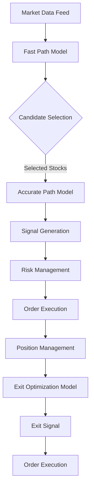

# Hybrid HFT Model Architecture

This document describes the hybrid high-frequency trading (HFT) model architecture implemented in the GH200 Trading System. The architecture is designed to efficiently process large amounts of market data and generate trading signals with low latency.

## Architecture Overview

The hybrid HFT model architecture consists of three main components:

1. **Fast Path Model**: A lightweight gradient boosting decision tree (GBDT) model that quickly scans the entire market (10,000+ stocks) to identify potential trading opportunities.
2. **Accurate Path Model**: A more sophisticated neural network model with axial attention that performs detailed analysis on the candidates identified by the fast path model.
3. **Exit Optimization Model**: An LSTM-based model that optimizes exit points for active positions.



## Data Flow

1. **Market Snapshot**: The system receives a full market snapshot with data for 10,000+ stocks.
2. **Fast Path Filtering**: The fast path model (GBDT) quickly processes all stocks and identifies ~300 candidates.
3. **Accurate Path Analysis**: The accurate path model performs detailed analysis on the selected candidates.
4. **Signal Generation**: Trading signals are generated for stocks that pass both filtering stages.
5. **Exit Optimization**: For active positions, the exit optimization model continuously evaluates optimal exit points.

## Model Implementation

### Fast Path Model (Market Scanner)

- **Implementation**: LightGBM model converted to ONNX format and optimized with TensorRT
- **Features**: 19 lightweight features including price ratios, volume metrics, and basic technical indicators
- **Latency Target**: < 50 microseconds per stock
- **Batch Processing**: Processes all stocks in batches for maximum throughput

### Accurate Path Model (Signal Generator)

- **Implementation**: Neural network with axial attention, converted to ONNX and optimized with TensorRT
- **Features**: 30+ detailed features including order book metrics, price dynamics, and market context
- **Latency Target**: < 500 microseconds per stock
- **Output**: Signal type (buy/sell), confidence score, and target price

### Exit Optimization Model

- **Implementation**: LSTM network for sequence modeling, converted to ONNX and optimized with TensorRT
- **Features**: Position-specific features and market condition changes
- **Latency Target**: < 200 microseconds per position
- **Output**: Exit probability and optimal exit price

## TensorRT Optimization

All models are optimized using NVIDIA TensorRT for maximum inference performance on the GH200 Grace Hopper Superchip:

1. ONNX models are optimized using ONNX Runtime's graph optimizations
2. TensorRT engines are built with FP16 precision for optimal performance
3. Engine caching is enabled to avoid rebuilding TensorRT engines on startup
4. Workspace size is optimized for GH200's memory capacity

## Python Integration

The system integrates C++ and Python components using pybind11:

2. **Market Snapshot Processor**: Python module for processing market data and extracting features
3. **Model Trainer**: Python module for training and exporting models

## Performance Considerations

- **CPU Affinity**: Critical threads are pinned to specific CPU cores
- **Memory Management**: Pre-allocated memory pools for minimal allocation during trading
- **Batch Processing**: Batch inference for maximum GPU utilization
- **Asynchronous Processing**: Non-blocking I/O for market data handling

## Configuration

The system is configured through the `config/system.yaml` file, which includes:

- Model paths for all three model types
- Inference settings (batch size, thresholds, etc.)
- Feature extraction configuration
- Performance tuning parameters

## Building and Running

1. Install dependencies:
   ```bash
   ./install_dependencies.sh
   ```

2. Build the system:
   ```bash
   mkdir -p build && cd build
   cmake ..
   make -j$(nproc)
   ```

3. Run the system:
   ```bash
   ./trading_system --config ../config/system.yaml
   ```

## Monitoring

The system includes real-time monitoring of:

- Inference latency for each model
- End-to-end latency from market data to signal generation
- GPU utilization and memory usage
- Signal quality metrics

## Future Improvements

- Implement A/B testing framework for model comparison
- Add support for multi-GPU inference for larger models
- Implement online learning for continuous model updates
- Add support for custom feature extraction in CUDA